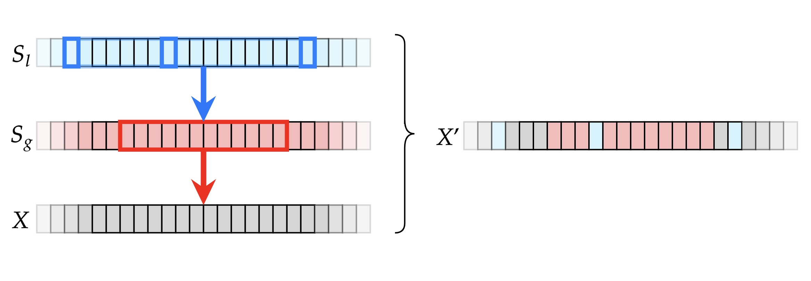

# PreIS: A Novel Data Augmentation Approach Using Protein Language Models for Influenza A Subtype Prediction

[]()
[]()
[]()

## Overview

Protein sequences have complex structures and are subject to strict rules regarding their composition and function. Generating new protein sequences without violating these rules is challenging. **PreIS** (Protein Improvement Strategy) is a novel data augmentation approach tailored specifically to the characteristics and constraints of protein sequences. 

Our approach leverages supervised guidance to preserve the underlying data distribution, significantly improving the generalization capabilities of machine learning models for virus subtype prediction.



---

## Key Features

- **Supervised Data Augmentation**: Uses labeled data to guide the generation of synthetic protein sequences.
- **PLM Integration**: Leverages state-of-the-art Protein Language Models (RITA) for sequence representation.
- **MC-NN Architecture**: Implementation of a Multi-Component Neural Network for robust classification.
- **Influenza A Focus**: Optimized for viral subtype prediction accuracy.

---

## Getting Started

### Prerequisites

Ensure you have Python 3.8+ installed. It is recommended to use a virtual environment.

### Installation

1. **Clone the repository:**
   ```bash
   git clone https://github.com/aminsoh/PreIS.git
   cd PreIS
   ```

2. **Install dependencies:**
   ```bash
   pip install torch pandas numpy transformers
   ```

3. **Verify RITA Model Weights:**
   Ensure the RITA model binaries are present in the `RITA/` directory as specified in the configuration.

### Usage

To start training the model with the default configuration:

```bash
python train.py
```

For the Multi-Component Neural Network (MC-NN) implementation, refer to the [MC_NN subdirectory](MC_NN/).

---

## Citation

If you find this work useful in your research, please cite:

```bibtex
@article{preis2023,
  title={PreIS: A Novel Data Augmentation Approach Using Protein Language Models for Influenza A Subtype Prediction},
  author={Sohrabi, Muhammad Amin and others},
  year={2023}
}
```
